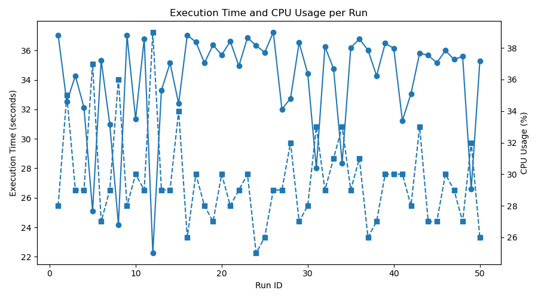

# Assignment 4: Many Matrix Multiplications

At the core of machine learning is a simple operation-- matrix multiplication. In this assignment you will be implementing a simple matrix multiplication engine for the purpose of exploring how our computer systems respond to intensive computational pressure.


## Part 1: Implementing Matrix Multiplication

You will implement a simple matrix multiplication C program.

Matrix multiplication takes the dot product of a row of input matrix A and a column of input matrix B to calculate an entry in matrix C:

$$c_{ij} = a_{i1} b_{1j} + a_{i2} b_{2j} + \cdots + a_{in} b_{nj} = \sum_{k=1}^n a_{ik} b_{kj}$$


The C program should take in command line arguments as follows.
```
Usage: ./matrix <rows1> <cols1> <cols2> <run forever? 0/1>
```

Your matrix multiplication program should implement two functions:

- `generate_matrix(int nrows, int ncols)` which generates a nrows x ncols matrix filled with random values using `rand()`.
- `int ** matrix_multiply(int ** A, int **B)` which generates a new output matrix by performing a matrix multiply between input matrix A and B.

```shell
$ ./matrix 100 100 100 0
Generating Matrices...Matrix 1 done.
Matrix 2 done.
Thu May 21 11:22:53 2026 100x100 matrices: 0.003189 seconds
```

> [!IMPORTANT]
> **TASK:** Complete the code in matrix.c to perform a matrix multiplication between two randomly generated matrixes. 


## Part 2: Varying the Size of the Matrix

You will now run a small experiment on the execution time of your matrix multiplication program.

> [!IMPORTANT]
> **TASK:** Add the ability to run a timed matrix multiplication job. This job should randomly generate two NxN matrices and time the output.

Your timing output must include output that follows the EXACT format below:
```
100x100 matrices: 0.008961 seconds
```

To time some code in C:

```c
struct timespec t0, t1;

timespec_get(&t0, TIME_UTC);  // C11 feature

// WHAT YOU WANT TO TIME

timespec_get(&t1, TIME_UTC);  // C11 feature

// nano seconds elapsed converted to fractional seconds
float dns = (float)(t1.tv_nsec - t0.tv_nsec) / 1000000000;
// seconds elapsed
float ds = (float)(t1.tv_sec - t0.tv_sec);

float total_time = dns+ds;

```


You have been provided with bash script `bench-single.sh` which creates a small loop to invoke your matrix multiplication program on various size matrices and save the output in a file with redirection: `> data/EXPERIMENT_NAME/mm-i.out`.

It also saves the CPU percentage in a file as well: `> data/EXPERIMENT_NAME/mm-i-cpu.out`

Finally, you may use the provided `plot.py` to create a graph of your results.

 > [!IMPORTANT]
> **TASK:** CRun the bash testing script and python plotting programs. Inspect the result of the experiment, comparing the execution time and CPU usage percent of matrix multiplications ranging from 100x100 to 1000x1000. Save testing result output files in directory `data/bench-single`. Save these file as `single-plot.png` for each size.


## Part 3: Varying the Number of Processes

Let's consider starting 10 matrix multiplications at the same time.

Your output plot for a single run of bench-multi.sh and plot.py should resemble something like the following:



> [!IMPORTANT]
> **TASK:** Create a python plotting program and bash tester script that times the matrix multiplication and CPU usage percentage with 10 concurrently running matrix multiplications. Run this experiment with 500x500 sized matrices. Save this file as `plot-multi.png`.

## Part 3: Varying the CPU Resource

The `taskset` command allows us to restrict which CPU the process can be scheduled on.

For example, the following command:
```
taskset -c 0 ./bench 100 100 100 0
```
Forces the 100x100 matrix multiplication to run on CPU 0.

> [!IMPORTANT]
> **TASK:** Modify the bash tester script, creating `bench-taskset.sh`, such that the different processes are all scheduled on the same CPU. Plot the time the matrix multiplication and CPU usage percentage as the number of processes increases. `plot-taskset.png`

## Part 4: Varying the Scheduling Priorities

The `nice` command allows you to schedule different processes with different priorities. 

For example:
```
nice -n 10 ./bench 100 100 100 0
```

Schedules a 100x100 matrix multiplication with "niceness" 10. Niceness ranges from -20 to 19 with the default being 0. A process that is "nicer" will step aside and allow other "less nice" processes to run more frequently.

> [!IMPORTANT]
> **TASK:** Modify your bash tester script, creating `bench-nice.sh`, to schedule some matrix multiplication tasks as low-priority (high niceness) and some as high-priority (low niceness). Save this plot as `plot-nice.png`.


## Part 5: Interactive Job Dispatching

Now, we want to create an "interactive" version of our matrix multiplication engine that takes in a list of jobs and implements a simple scheduling policy.

We will implement two scheduling policies:
- FIFO (first-in-first-out)
- SJF (shortest job first)

Matrix multiplication has a nice property-- the size of the matrix correlates directly to the time required to complete the task!

This engine will take in arguments in the format:
```
Usage: ./interactive <FIFO/SJF> <job_sizes_comma_separated> 
```

Then, the program will:
- Parse the inputs from the user of jobs to run in the format `100,200,400` meaning matrix multiply a 100x100 matrices, 200x200 matrices, 400x400 matrices.
- At the end of a line it will schedule and run all of those jobs with the chosen scheduling policy. (FIFO for fifo, or SJF for SJF)
- The program will report on the throughput and average response time.

You should do the necessary bookkeeping to report throughput and average response time. 


> [!IMPORTANT]
> **TASK:** Create `interactive.c` which allows users to input in new job requests via the command line. Implement a simple shortest-job-first scheduling policy in your interactive matrix multiplication program.

At this point you should pass all tests `source test.sh`.
Make sure to submit your work to Gradescope!


